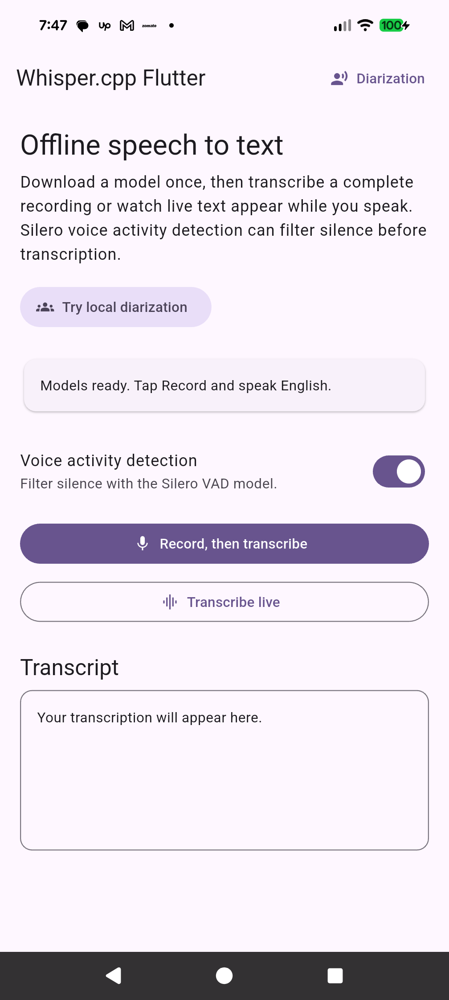
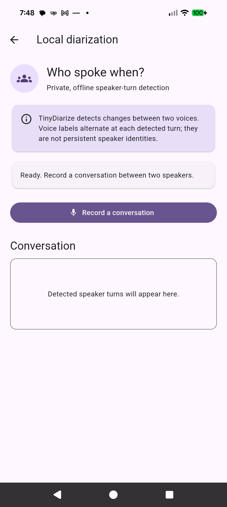

# whisper_cpp_flutter_plus

Run private, offline speech-to-text in Flutter with `whisper.cpp` v1.9.2.
This plugin provides native Android and iOS bindings for transcription,
translation, microphone capture, streaming results, model management, and
voice activity detection (VAD). Audio stays on the device after a model has
been downloaded or provided by your application.

## Screenshots

The example app demonstrates offline speech-to-text, live transcription,
Silero voice activity detection, and private on-device speaker-turn detection.

<p align="center">
  
  
</p>

## Features

- Offline transcription and translation
- Automatic or explicit language selection
- Greedy and beam-search decoding
- Segment, word, and token timestamps
- Token probabilities and speaker-turn markers
- Initial prompts, token suppression, and decoding thresholds
- Non-blocking inference with progress updates and cancellation
- Complete-recording and live microphone transcription
- Windowed streaming for any mono PCM source
- WAV decoding, channel mixing, and sample-rate conversion
- Integrated and standalone Silero VAD, including continuous VAD
- Resumable model downloads, a checksum-pinned catalog, listing, and deletion
- Sequential PCM/WAV batches that reuse one loaded model
- Plain text, JSON, SRT, and WebVTT result export
- Android CPU acceleration for ARM64 and ARMv7
- iOS Accelerate, Metal, and optional Core ML encoder acceleration

The package vendors the upstream source revision associated with stable
`whisper.cpp` v1.9.2. Whisper and Silero model files are not bundled.

## Supported platforms

- Android API 24 or later
- iOS 14 or later

Web, macOS, Windows, and Linux are not currently supported.

## Installation

Add the package to your Flutter project:

```sh
flutter pub add whisper_cpp_flutter_plus
```

Import the public API:

```dart
import 'package:whisper_cpp_flutter_plus/whisper_cpp_flutter_plus.dart';
```

## Platform configuration

### Android

The plugin adds `RECORD_AUDIO` to the merged manifest. Request permission at
runtime with `WhisperRecorder.requestPermission()`, or let
`WhisperEngine.transcribeMicrophone()` request it when live transcription
starts.

### iOS

The plugin supports both CocoaPods and Flutter's Swift Package Manager
integration. Flutter selects the dependency manager configured by the
application; no native package dependency needs to be added manually.

Add a microphone usage description to your application's `Info.plist`:

```xml
<key>NSMicrophoneUsageDescription</key>
<string>Microphone access is used for offline transcription.</string>
```

To use Core ML acceleration, place a compiled encoder such as
`ggml-base.en-encoder.mlmodelc` beside the matching `ggml-base.en.bin` model.
If the encoder is unavailable, inference falls back to Metal or the CPU.

## Load a model

Your application can obtain a compatible GGML model from any source and pass
its readable local filesystem path directly to the engine:

```dart
final modelPath = await downloadModelToAppStorage();
final engine = await WhisperEngine.load(modelPath);
```

`WhisperEngine.load()` does not copy, move, or take ownership of the file. Keep
the model available until `engine.dispose()` is called.

### Optional model manager

`WhisperModelManager` can download and manage models in the application support
directory. It accepts any HTTPS URL; Hugging Face is only one possible source.
Plain HTTP requires an explicit insecure opt-in.

```dart
final models = WhisperModelManager();

await for (final progress in models.download(
  Uri.parse(
    'https://huggingface.co/ggerganov/whisper.cpp/'
    'resolve/main/ggml-base.en.bin',
  ),
  'ggml-base.en.bin',
  // sha256Hex: 'expected model checksum',
)) {
  print(progress.fraction);
}

final model = await models.find('ggml-base.en.bin');
if (model == null) {
  throw StateError('Model download did not complete.');
}

final engine = await WhisperEngine.load(model.path);
```

Supplying `sha256Hex` is recommended when the expected checksum is known.

### Verified model catalog

The curated catalog pins both immutable upstream revisions and SHA-256 hashes
for common mobile Whisper, Silero VAD, and TinyDiarize models:

```dart
final models = WhisperModelManager();
final descriptor = WhisperModelCatalog.tinyEnglish;

final cached = await models.findCatalogModel(descriptor);
if (cached == null) {
  await for (final progress in models.downloadCatalogModel(descriptor)) {
    print(progress.fraction);
  }
}

final verified = await models.findCatalogModel(descriptor);
if (verified == null) throw StateError('Model was not installed.');
final engine = await WhisperEngine.load(verified.path);
```

Catalog lookup verifies an existing cached file before returning it. A mismatch
throws `FormatException` and leaves the file in place for application-directed
cleanup. Arbitrary downloads require HTTPS unless `allowInsecureHttp: true` is
explicitly supplied. Call `models.close()` when a manager that owns its HTTP
client is no longer needed.

## Transcribe a WAV file

`WhisperAudio.readWav()` converts supported WAV input to the mono 16 kHz
`Float32` PCM expected by whisper.cpp.

```dart
final samples = await WhisperAudio.readWav(File('/path/to/audio.wav'));
final task = engine.transcribe(
  samples,
  options: const TranscribeOptions(
    language: 'auto',
    tokenTimestamps: true,
  ),
);

task.progress.listen((percent) => print('$percent%'));

final result = await task.result;
print(result.text);
```

Call `task.cancel()` to stop active inference.

### Export a result

Completed results can be exported without writing files:

```dart
final result = await engine.transcribe(samples).result;
final plainText = result.toPlainText();
final json = result.toJsonString();
final compactJson = result.toJsonString(includeTokens: false);
final srt = result.toSrt();
final webVtt = result.toVtt();
```

SRT and WebVTT cues use native Whisper segment timestamps. Detailed token
metadata is included in JSON by default.

### Transcribe a batch

A batch accepts prepared PCM and WAV files, processes them sequentially, and
reuses the engine's already-loaded model:

```dart
final batch = engine.transcribeBatch(
  [
    WhisperWavBatchInput('interview', File('/path/interview.wav')),
    WhisperPcmBatchInput('memo', memoSamples),
  ],
  defaultOptions: const TranscribeOptions(language: 'en'),
  continueOnError: true,
);

batch.updates.listen((progress) {
  print('${progress.completed}/${progress.total}: ${progress.currentId}');
});

final items = await batch.result;
for (final item in items) {
  if (item.isSuccess) {
    print('${item.input.id}: ${item.result!.text}');
  } else {
    print('${item.input.id} failed: ${item.error}');
  }
}
```

The default stops on the first loading or inference error. With
`continueOnError: true`, failures are captured in their ordered item results.
Call `batch.cancel()` to cancel active native inference and skip remaining
items. Use separate engine instances when parallel inference is required.

### Offline performance modes

Apply a reusable performance mode to any offline transcription options:

```dart
final options = const TranscribeOptions(language: 'en')
    .withPerformanceMode(WhisperPerformanceMode.responsive);
final result = await engine.transcribe(samples, options: options).result;
```

`responsive` uses four threads with greedy best-of 1 and disables timestamps
to prioritize latency. `balanced` preserves the package defaults. `efficient`
uses two threads with greedy best-of 1 and disables timestamps to reduce CPU
concurrency and decoding work; it does not guarantee lower latency or battery
usage. These presets are intended for offline transcription and do not change
streaming window behavior.

## Transcribe the microphone live

```dart
final task = await engine.transcribeMicrophone(
  options: const TranscribeOptions(language: 'en'),
);

task.updates.listen((update) {
  print(update.text);
});

// Flush the remaining audio and finish the transcript.
final complete = await task.stop();
print(complete.confirmedText);
```

The plugin manages microphone permission, capture, rolling windows, overlap
removal, timestamp rebasing, and final flushing. With the default
`WhisperStreamConfig`, it decodes every two seconds using a 30-second window
and keeps the newest four seconds provisional.

`confirmedText` and `confirmedSegments` are append-only. Partial content can
change as later windows add context, so replace it in the UI on every update.
`stop()` produces a final result, while `cancel()` aborts the operation with a
`WhisperException`.

Smaller models are recommended when transcription must keep up with speech on
mobile hardware.

## Transcribe another PCM stream

Use the same streaming pipeline with any stream of mono PCM chunks:

```dart
final task = engine.transcribeStream(
  audioChunks, // Stream<RecordingChunk>
  options: const TranscribeOptions(language: 'auto'),
  config: const WhisperStreamConfig(
    updateInterval: Duration(seconds: 2),
    windowDuration: Duration(seconds: 30),
    confirmationLag: Duration(seconds: 4),
  ),
);

task.updates.listen((update) => print(update.text));
final complete = await task.result;
```

Chunks are continuously resampled to 16 kHz. The source must use one sample
rate for the lifetime of a stream. The task completes when the source stream
closes.

## Voice activity detection

For integrated VAD, set both `enableVad` and `vadModelPath`:

```dart
final task = engine.transcribe(
  samples,
  options: const TranscribeOptions(
    enableVad: true,
    vadModelPath: '/path/to/ggml-silero-v6.2.0.bin',
  ),
);
```

Silero VAD can also be used independently:

```dart
final vad = WhisperVad.load('/path/to/ggml-silero-v6.2.0.bin');
final containsSpeech = vad.isSpeech(samples);
final speechRanges = vad.segments(samples);
vad.dispose();
```

## Resource management

Call `dispose()` on every `WhisperEngine` and `WhisperVad` when it is no longer
needed. A one-shot or streaming job reserves its engine until completion. Use
separate engine instances for parallel inference.

## Example application

Connect a physical Android or iOS device and run:

```sh
cd example
flutter pub get
flutter run
```

The example downloads the tiny English model once and demonstrates both
record-then-transcribe and recorder-style live transcription.

### Reproducible benchmark

The example also includes a fixed physical-device benchmark using the tiny
English model and the 11-second JFK sample. It compares Responsive, Balanced,
and Efficient with one warm-up and three measured runs per mode, recording
model-load time, native processing time, Dart/isolate overhead, real-time
factor, WAV byte size and duration, transcript accuracy, and every resolved
option in machine-readable JSON.

Run the example on a physical device in release mode:

```sh
cd example
flutter run --release -d DEVICE_ID
```

Open **Benchmark**, run the fixed workload, then choose **Copy results as JSON**.
Use **Play benchmark WAV** to hear the bundled source and cross-check the
displayed transcripts; playback is stopped before and excluded from benchmark
timing.
For valid manual comparisons, keep the physical device, OS, release mode,
model hash, audio hash, and pinned benchmark configuration unchanged. The
benchmark measures latency and accuracy, not energy or memory consumption.

## Request a feature

Need a capability that is not currently supported? [Submit a feature
request](https://github.com/47gurvinder/whisper_cpp_flutter/issues/new?template=feature_request.yml)
and describe your use case, desired behavior, and target platform. Please
search the existing issues first to avoid duplicates.

## Need help with whisper.cpp or another AI solution?

Looking to integrate this plugin into an existing app, build a custom product
on top of whisper.cpp, or create another AI-powered mobile or web solution? I
can help with architecture, Flutter plugin development, native Android and iOS
integration, speech-to-text workflows, model integration, performance
optimization, debugging, upgrades, and long-term maintenance.

Whether you need a focused integration, a custom plugin, help maintaining an
existing package, or a complete application, get in touch to discuss your
requirements:

- [Contact Gurwinder DevX](https://gurwinderdevx.com/)
- [Hire me on Upwork](https://www.upwork.com/freelancers/gurwinderdevx)

## Author and support

Developed and maintained by **Gurwinder Singh**, a full-stack web and mobile
application developer and founder of
[Gurwinder DevX](https://gurwinderdevx.com/).

- [GitHub](https://github.com/47gurvinder)
- [LinkedIn](https://www.linkedin.com/in/gurwinderdevx/)
- [Upwork](https://www.upwork.com/freelancers/gurwinderdevx)
- [Buy Me a Coffee](https://buymeacoffee.com/gurwinderdevx)

If this package helps your project, consider supporting its continued
development through Buy Me a Coffee.

## Acknowledgements

This plugin builds on the work of the
[whisper.cpp authors and contributors](https://github.com/ggml-org/whisper.cpp).

## License

This plugin and the vendored whisper.cpp source are available under the MIT
License. Whisper model licensing and distribution requirements remain the
application developer's responsibility.
